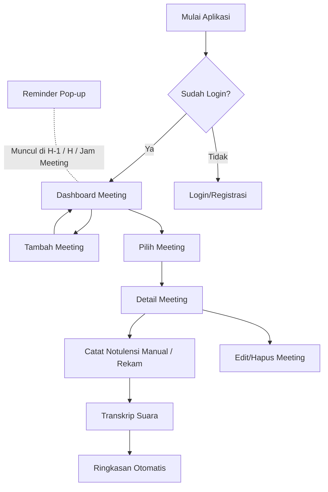
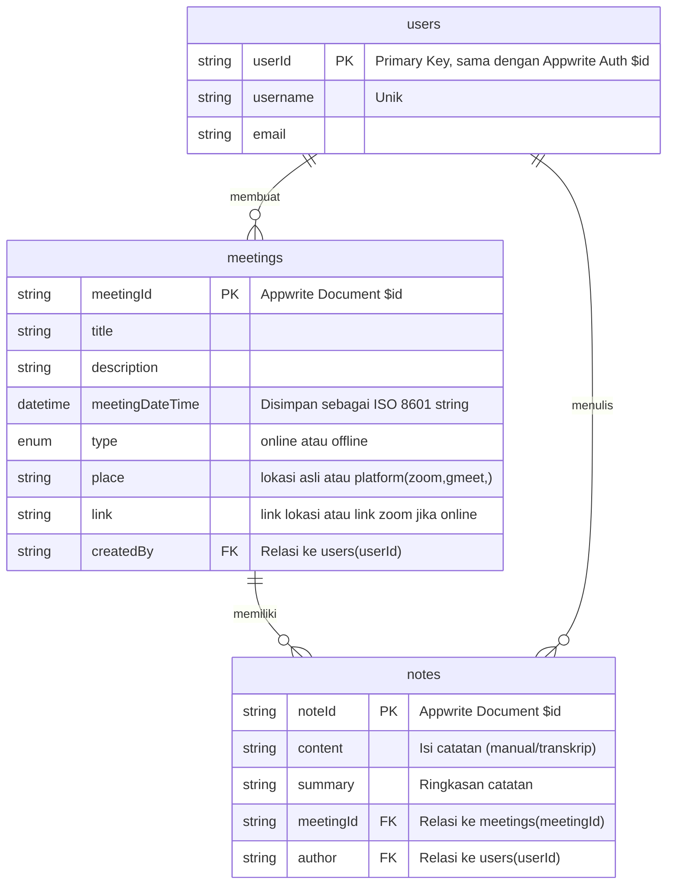

### Dokumen Software Requirement Specification (SRS)

## Aplikasi Pengingat & Notulensi Meeting 'PlinPlan Meeting'

**Versi:** 0.1
**Tanggal:** 27 Mei 2025
**Penyusun:** Azhar Maulana F (221240001263)

---

### 1. Pendahuluan

#### 1.1 Tujuan Dokumen

Dokumen ini disusun untuk mendefinisikan kebutuhan perangkat lunak dari MVP aplikasi *PlinPlan Meeting*, yang bertujuan membantu pengguna dalam mengatur agenda meeting, mencatat notulensi, dan menerima pengingat meeting pribadi.

#### 1.2 Ruang Lingkup Produk (MVP)

Aplikasi *PlinPlan Meeting* adalah aplikasi mobile berbasis Flutter yang memungkinkan pengguna untuk:

* Mendaftar dan login.
* Membuat, mengedit, dan menghapus agenda meeting.
* Menyimpan dan melihat notulensi meeting.
* Menerima pengingat meeting (H-1, Hari-H, dan jam saat meeting).
* Menggunakan transkripsi otomatis dari suara ke teks untuk pencatatan notulensi.
* Meringkas hasil transkripsi menjadi poin-poin penting.

#### 1.3 Definisi, Akronim, dan Singkatan

* **MVP**: Minimum Viable Product
* **UI**: User Interface
* **UX**: User Experience
* **Appwrite**: Backend-as-a-Service platform
* **STT**: Speech to Text

---

### 2. Deskripsi Umum

#### 2.1 Perspektif Produk

Aplikasi ini merupakan sistem mobile mandiri yang memanfaatkan Appwrite sebagai backend dan penyimpanan database. Tidak ada manajemen grup, aplikasi ditujukan untuk penggunaan personal.

#### 2.2 Fungsi Utama Produk

* Autentikasi pengguna
* CRUD agenda meeting
* Reminder meeting (H-1, Hari-H, dan jam H)
* Pencatatan notulensi (manual atau via transkrip suara)
* Ringkasan otomatis notulensi

#### 2.3 Karakteristik Pengguna

* Mahasiswa
* Profesional muda
* Pengguna individu yang memiliki kegiatan meeting rutin

#### 2.4 Batasan Umum

* Tidak mendukung grup dan kolaborasi multi-user
* Tidak ada sinkronisasi ke kalender eksternal
* Reminder hanya berupa notifikasi pop-up in-app
* Semua data disimpan pada 1 database collection

#### 2.5 Asumsi dan Ketergantungan

* Pengguna memiliki koneksi internet
* Appwrite tersedia dan stabil
* Flutter SDK kompatibel dengan perangkat pengguna

---

### 3. Kebutuhan Spesifik

#### 3.1 Alur Pengguna

1. Pengguna membuka aplikasi
2. Registrasi/login akun
3. Dashboard daftar meeting pribadi
4. Tambah/edit/hapus meeting
5. Catat notulensi atau rekam suara
6. Transkrip otomatis dari suara
7. Ringkasan poin penting
8. Reminder muncul di H-1, Hari-H, dan saat jam meeting

#### 3.2 Kebutuhan Fungsional

* **F01**: Pengguna dapat registrasi dan login
* **F02**: Pengguna dapat membuat, melihat, mengedit, dan menghapus agenda meeting
* **F03**: Pengguna dapat mencatat notulensi secara manual
* **F04**: Pengguna dapat merekam suara dan menghasilkan transkrip otomatis
* **F05**: Aplikasi meringkas transkrip menjadi poin-poin penting
* **F06**: Aplikasi menampilkan pop-up notifikasi reminder (H-1, Hari-H, dan jam H)

#### 3.3 Kebutuhan Non-Fungsional

* **NF01**: Aplikasi berjalan minimal Android 8.0
* **NF02**: Waktu respon maksimal 2 detik
* **NF03**: UI sederhana dan mudah digunakan
* **NF04**: Validasi dan notifikasi error jelas dan cepat

#### 3.4 Kebutuhan Antarmuka Eksternal

* Appwrite SDK (Flutter)
* flutter\_local\_notifications
* Whisper API / Hugging Face API (Speech-to-Text)
* Summarizer API (OpenAI/GPT/HF)(opsional)

---

### 4. Rancangan Skema Database (Appwrite)
#### Collection: users

| Field     | Type   | Description                  | Notes                 |
|-----------|--------|------------------------------|-----------------------|
| userId    | string | Appwrite ID (primary key)    | Dari Appwrite Auth    |
| username  | string | Nama pengguna (unik)          | Harus unik            |
| email     | string | Email pengguna                | Dari Appwrite Auth    |

---

#### Collection: meetings

| Field       | Type     | Description              | Notes                  |
|-------------|----------|--------------------------|------------------------|
| meetingId   | string   | Appwrite ID (primary key)|                        |
| title       | string   | Judul meeting            |                        |
| description | string   | Deskripsi singkat        |                        |
| meetingDateTime | datetime | Tanggal dan waktu meeting          |                        |
| type | enum | online atau offline meeting          |                        |
| place | string | lokasi asli atau  platform (zoom,gmeet)meeting          |
| link | string | link lokasi(maps) atau link zoom meeting          |                        |                        |
| createdBy   | string   | userId pembuat meeting   | FK → users.userId      |

---

#### Collection: notes

| Field       | Type   | Description                   | Notes                 |
|-------------|--------|-------------------------------|-----------------------|
| noteId      | string | Appwrite ID (primary key)      |                       |
| meetingId   | string | ID meeting                    | FK → meetings.meetingId|
| content     | string | Isi catatan (manual/transkrip)|                       |
| summary     | string | Ringkasan catatan             |                       |
| author      | string | userId penulis catatan        | FK → users.userId     |

---

### 5. Arsitektur Sistem

* Flutter frontend
* Appwrite backend (Auth & Database)
* Whisper atau HuggingFace API untuk transkrip
* OpenAI/GPT untuk ringkasan notulensi
* Notifikasi lokal menggunakan `flutter_local_notifications`

---

### 6. Estimasi Timeline Pengembangan (6 Minggu)

| Minggu | Aktivitas                                             |
| ------ | ----------------------------------------------------- |
| 1      | Setup project Flutter, desain UI awal, setup Appwrite |
| 2      | Implementasi login & registrasi, pengujian Auth       |
| 3      | CRUD meeting, tampilan list dan detail                |
| 4      | Reminder meeting dengan notifikasi lokal              |
| 5      | Modul pencatatan dan transkrip suara + API eksternal  |
| 6      | Ringkasan otomatis, debugging, dan finalisasi UI/UX   |

---

### 7. Diagram Alur

---

### 8. Relasi Database (ER Diagram)

---

### 9. Penutup

Dokumen ini merupakan acuan resmi untuk pengembangan MVP aplikasi *PlinPlan Meeting* versi personal dengan fitur reminder dan notulensi pintar. Perubahan lanjutan akan didokumentasikan pada versi berikutnya.
