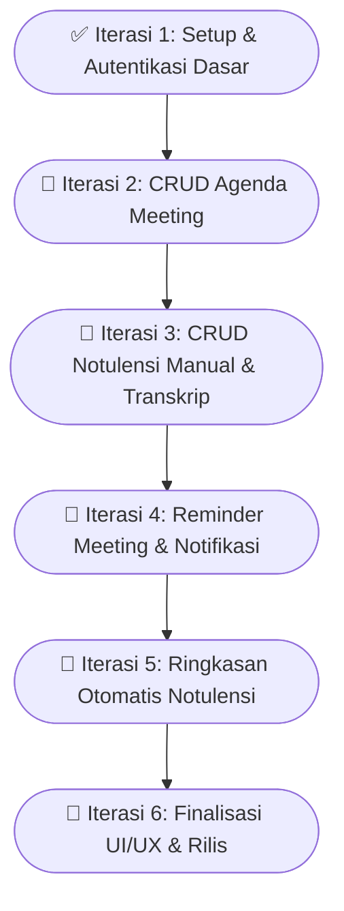

## ✅📊 Progress Iterasi (Detail & Terperinci)

---

### Iterasi Minggu ke-1 – Setup & Autentikasi Dasar

| Task                                                                                                            | Status |
| --------------------------------------------------------------------------------------------------------------- | ------ |
| 1. Setup project Flutter dengan struktur folder dan dependensi dasar                                            | ✅      |
| 2. Setup Appwrite backend: konfigurasi auth & database collections                                              | ✅      |
| 3. Buat koleksi database di Appwrite: `users` (gabungkan profil & auth minimal data)                            | ✅      |
| 4. Buat koleksi database di Appwrite: `meetings`                                                                | ✅      |
| 5. Buat koleksi database di Appwrite: `notes`                                                                   | ✅      |
| 6. Implementasi fungsi registrasi user baru dengan `account.create` (input email, password, fullname, username) | ❌      |
| 7. Implementasi fungsi login dengan `account.createEmailSession` (email + password)                             | ❌      |
| 8. Validasi input pada form registrasi dan login (email format, password kuat, username unik)                   | ❌      |
| 9. Simpan data `fullname` dan `username` sebagai atribut tambahan pada dokumen `users`                          | ❌      |

**Total task = 9**
**Task selesai = 5**
**Persentase progress = (5/9) × 100% ≈ 55.6%**

---

### Iterasi Minggu ke-2 – CRUD Agenda Meeting (Tabel `meetings`)

| Task                                                                                                                  | Status |
| --------------------------------------------------------------------------------------------------------------------- | ------ |
| 1. Buat halaman UI untuk tambah meeting (form input `title`, `description`, `meetingDate`, `meetingTime`)             | ❌      |
| 2. Buat halaman UI untuk edit meeting yang sudah dibuat                                                               | ❌      |
| 3. Buat fungsi untuk hapus meeting dari database                                                                      | ❌      |
| 4. Implementasi fungsi simpan meeting baru ke koleksi `meetings` di Appwrite                                          | ❌      |
| 5. Implementasi fungsi update data meeting di Appwrite                                                                | ❌      |
| 6. Implementasi fungsi hapus data meeting di Appwrite                                                                 | ❌      |
| 7. Buat halaman daftar meeting yang hanya menampilkan meeting dengan `createdBy = userId login`                       | ❌      |
| 8. Tambahkan validasi di backend/ frontend agar hanya bisa edit/hapus meeting milik sendiri (berdasarkan `createdBy`) | ❌      |

**Total task = 8**
**Task selesai = 0**
**Persentase progress = 0%**

---

### Iterasi Minggu ke-3 – CRUD Notulensi Manual dan Transkrip Otomatis (Tabel `notes`)

| Task                                                                                       | Status |
| ------------------------------------------------------------------------------------------ | ------ |
| 1. Buat halaman UI untuk tambah catatan manual (field input `content`)                     | ❌      |
| 2. Implementasi fungsi simpan catatan baru ke koleksi `notes` dengan relasi ke `meetingId` | ❌      |
| 3. Implementasi fungsi update catatan di Appwrite                                          | ❌      |
| 4. Implementasi fungsi hapus catatan                                                       | ❌      |
| 5. Buat fungsi rekam suara di aplikasi                                                     | ❌      |
| 6. Integrasi API Whisper/HuggingFace untuk transkripsi suara ke teks                       | ❌      |
| 7. Simpan hasil transkrip ke field `content` pada koleksi `notes`                          | ❌      |
| 8. Hubungkan catatan dengan `author` (userId yang membuat)                                 | ❌      |

**Total task = 8**
**Task selesai = 0**
**Persentase progress = 0%**

---

### Iterasi Minggu ke-4 – Reminder Meeting dengan Notifikasi Lokal

| Task                                                                                        | Status |
| ------------------------------------------------------------------------------------------- | ------ |
| 1. Buat sistem perhitungan waktu reminder dari `meetingDate + meetingTime`                  | ❌      |
| 2. Setup notifikasi lokal di Flutter (gunakan plugin seperti flutter\_local\_notifications) | ❌      |
| 3. Buat pengaturan reminder untuk beberapa waktu: H-1 hari, hari-H, jam-H                   | ❌      |
| 4. Munculkan pop-up notifikasi reminder saat waktu meeting tiba                             | ❌      |
| 5. Buat UI untuk mengatur dan mengaktifkan/menonaktifkan reminder meeting                   | ❌      |

**Total task = 5**
**Task selesai = 0**
**Persentase progress = 0%**

---

### Iterasi Minggu ke-5 – Ringkasan Otomatis Notulensi

| Task                                                                                              | Status |
| ------------------------------------------------------------------------------------------------- | ------ |
| 1. Implementasi pengiriman teks notulensi (field `content`) ke API ringkasan (OpenAI/HuggingFace) | ❌      |
| 2. Terima hasil ringkasan dan simpan ke field `summary` di koleksi `notes`                        | ❌      |
| 3. Tampilkan ringkasan di halaman detail meeting (tampilan read-only)                             | ❌      |
| 4. Berikan opsi refresh ringkasan untuk update otomatis                                           | ❌      |

**Total task = 4**
**Task selesai = 0**
**Persentase progress = 0%**

---

### Iterasi Minggu ke-6 – Finalisasi UI/UX, Validasi, dan Rilis

| Task                                                                        | Status |
| --------------------------------------------------------------------------- | ------ |
| 1. Perbaikan UI/UX pada semua halaman (responsif, tampilan konsisten)       | ❌      |
| 2. Implementasi validasi input dan loading state pada form dan tombol       | ❌      |
| 3. Testing fungsionalitas lengkap: registrasi, login, CRUD meetings & notes | ❌      |
| 4. Perbaikan bug dari hasil testing                                         | ❌      |
| 5. Build APK/AAB untuk rilis                                                | ❌      |
| 6. Buat dokumentasi lengkap dan siapkan bahan demo presentasi               | ❌      |

**Total task = 6**
**Task selesai = 0**
**Persentase progress = 0%**

---

## 📈 Total Progres Keseluruhan

**Total task = 9 + 8 + 8 + 5 + 4 + 6 = 40**
**Task selesai = 5**
**Persentase progress = (5 / 40) × 100% = 12.5%**

---

---
